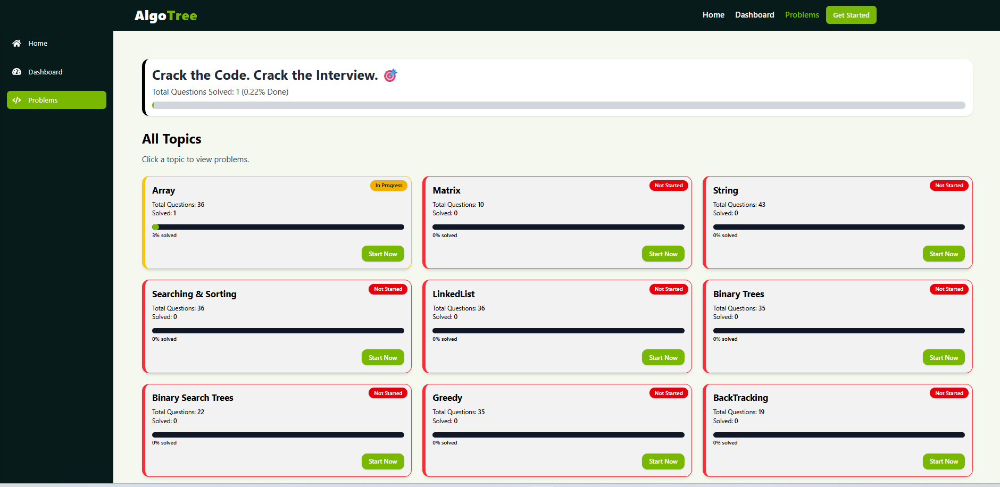

# 🌳 Welcome to **AlgoTree**

**AlgoTree** is your one-stop platform to master Data Structures and Algorithms (DSA)!  
We combine powerful problem-solving tools, curated YouTube video explanations, and progress tracking in one sleek dashboard — all tailored to help you become a better programmer.

---

## 🚀 Features

- ✅ **Track Your DSA Progress**  
  Organize problems by topics like Arrays, Trees, Graphs, etc., and mark them as done as you progress.

- 🎥 **Best YouTube Explanations**  
  Watch handpicked video tutorials for each problem from top educators and creators.

- 🔗 **Solve on Your Favorite Platform**  
  Easily jump to problems on LeetCode, GeeksforGeeks, etc.

- 📝 **Add Personal Notes**  
  Write your own solutions or strategies for any problem and store them locally.

- 📊 **Interactive UI with Real-Time Feedback**  
  Built with React + Tailwind for a clean and responsive experience.

---

## 📸 Preview

---

## 🛠 Tech Stack

- **Frontend**: React.js, Tailwind CSS  
- **State Management**: Context API  
- **Local Storage**: For notes and progress  
- **Future Backend**: Node.js / Express + MongoDB (Coming soon...)

---

## 🧠 Ideal For

- Students preparing for placements and coding interviews  
- Self-learners brushing up on algorithms  
- Developers wanting to stay sharp with daily practice

---

## 🧑‍💻 How to Contribute

1. Fork the repository  
2. Clone it: `git clone https://github.com/GOBINDA-GAGAN/AlgoTree.git`  
3. Run `npm install`  
4. Start with `npm run dev`  
5. Add your feature or fix  
6. Submit a pull request 🚀

---

## 📬 Feedback & Suggestions

Have ideas, improvements or bugs to report?  
Open an issue or contact us at: **gobindagagandey@gmail.com**

---

## 👨‍💼 Owner & Portfolio

Made with ❤️ by **Gobinda Gagan Dey**  
🔗 [Visit My Portfolio](https://gobinda-gagan-dey.vercel.app/) 
📧 Email: gobindagagandey@gmail.com  
🌐 GitHub: [GOBINDA-GAGAN](https://github.com/GOBINDA-GAGAN)

---

## ⭐ Star the Repo

If you like the project, don’t forget to ⭐ the repository to support us!

---

Happy Coding! 💻🌱
